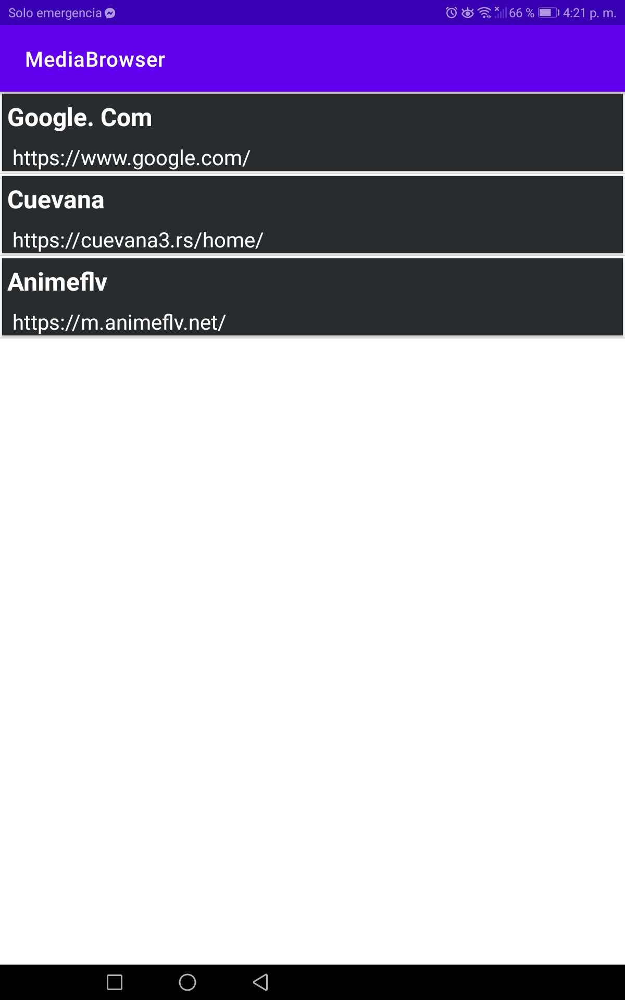

# MediaBrowser
Aplicacion Android de visualizacion de contenidos web sin redireccionamientos de Adds
##
La Aplicacion esta acondicionada para una navegacion como esta habituado en Otro navegado web.  
  
Por favor tenga en cuenta que la app bloquea todos los redireccionamientos que conlleven enviarlo  
a otro sitio web o que lo saque de la aplicacion, por ejemplo, llevarlo a la PlayStore para que descargue una app.  
Por ende, algunas funciones de ciertas paginas que le pidan verificacion de usuario por redireccionamiento (loging con: google, facebook, disquss...) tambien se veran bloqueados.  
  
A futuro intentaremos gestionar los redireccionamientos... entre otras funciones.

